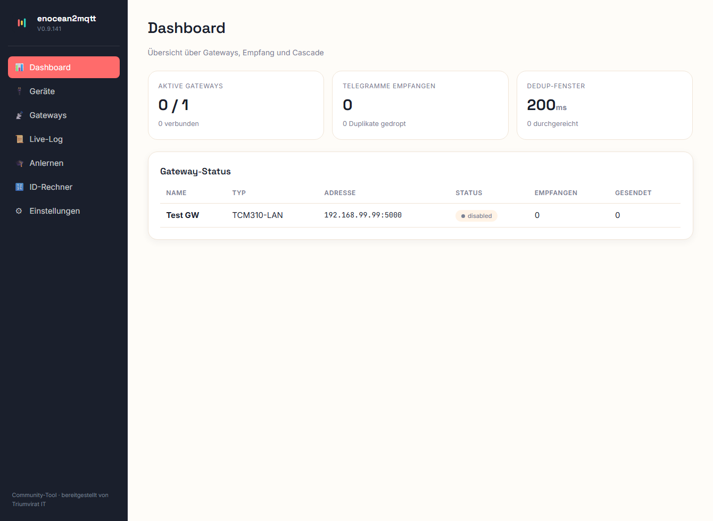
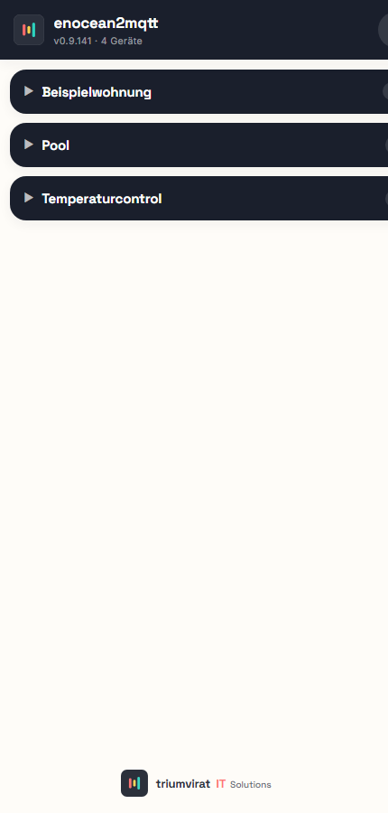

# enocean2mqtt-timberwolf

EnOcean-zu-MQTT-Bridge, die als Docker-Container direkt auf einem **Timberwolf-Server**
(oder jedem anderen Docker-Host) läuft. Empfängt EnOcean-Funktelegramme über **mehrere
LAN-Gateways parallel** (TCM310/TCM515), dekodiert sie via EEP-Profile und published sie
nach MQTT — und sendet Schalt-/Dimm-/Rolladen-Befehle zurück an Aktoren.

Bedienung und Konfiguration laufen über eine integrierte **Web-UI** (Geräte- und
Gateway-Verwaltung, Anlern-Modus, Live-Telegramm-Log).

## Features

- **Multi-Gateway parallel** — mehrere LAN-Gateways gleichzeitig, mit globaler
  Kaskadierung (Dedup über alle Gateways + RSSI-basierte Sender-Auswahl).
- **EEP-Decoding** — F6 (Taster), A5 (4BS: Temp/Feuchte/Zähler/Wetter/Heizung),
  D2 (VLD), D5 (Kontakt) u. a.
- **MQTT** — Raw- und benannte Topics (`floor/room/device/channel`), `.../set` für Befehle,
  Last-Will/Online-Status.
- **Senden + Teach-In** — Schalten, Dimmen, Rolladen fahren; Lerntelegramme an Aktoren;
  OPUS/Eltako-Pairing.
- **Rolladen-Positionstracking** — software-seitige Positionsberechnung mit getrennten
  Heben-/Senken-Laufzeiten (Eichfahrt), Befehlsschema `{"move"/"step"/"stop"}`.
- **Web-UI** — FastAPI + Vue (kein Build-Step), Desktop- und Mobile-Ansicht.

## Web-UI

Geräte- und Gateway-Verwaltung, Anlern-Modus und Live-Telegramm-Log laufen über
die integrierte Web-UI (Desktop + Mobil):



<p></p>

## Quick Start (Docker)

```bash
# Beispiel-Konfig kopieren und IPs/Ports deiner LAN-Gateways eintragen
cp data/gateways.example.yaml data/gateways.yaml

docker compose up --build
```

Danach Web-UI öffnen: **http://localhost:8080**

Die Gateways/Geräte lassen sich auch direkt über die Web-UI verwalten und anlernen;
`data/gateways.yaml`/`data/devices.yaml` werden dort gepflegt (Beispiele liegen als
`*.example.yaml` bei).

## Lokal entwickeln (ohne Docker)

```bash
python -m pip install -r requirements.txt

# Tests
python -m pytest tests/ -q

# Headless starten (CONFIG_DIR=test-data, Web-UI auf :8080)
python run-test.py
```

Python 3.11. Konfiguration über `CONFIG_DIR` (Default `/data`, lokal `test-data`).

## Auf einem Timberwolf deployen

Der Timberwolf hat keinen SSH-Zugang am Host — Deployment läuft über **Portainer**.
Schritt-für-Schritt: **[DEPLOY.md](DEPLOY.md)**.

## Architektur

```
LAN-GW (n) → GatewayManager → Cascade (Dedup) → TelegramPipeline → MQTT-Publish
                  │ rx_queue                          │                 └→ Web-UI Live-Log / Anlernen
                  └ ESP3-TCP-Empfang                  └ EEP-Decode + Device-Lookup
MQTT .../set → MQTTPublisher → TXRouter → Encoder → Gateway-Send
```

Einstieg in den Code: `app/main.py` (`amain()`) verdrahtet alle Komponenten.
EEP-Profile (Decoder + Encoder + UI-Metadaten) liegen in `app/eep/`.

## Lizenz

[MIT](LICENSE) — © 2026 Triumvirat IT.
